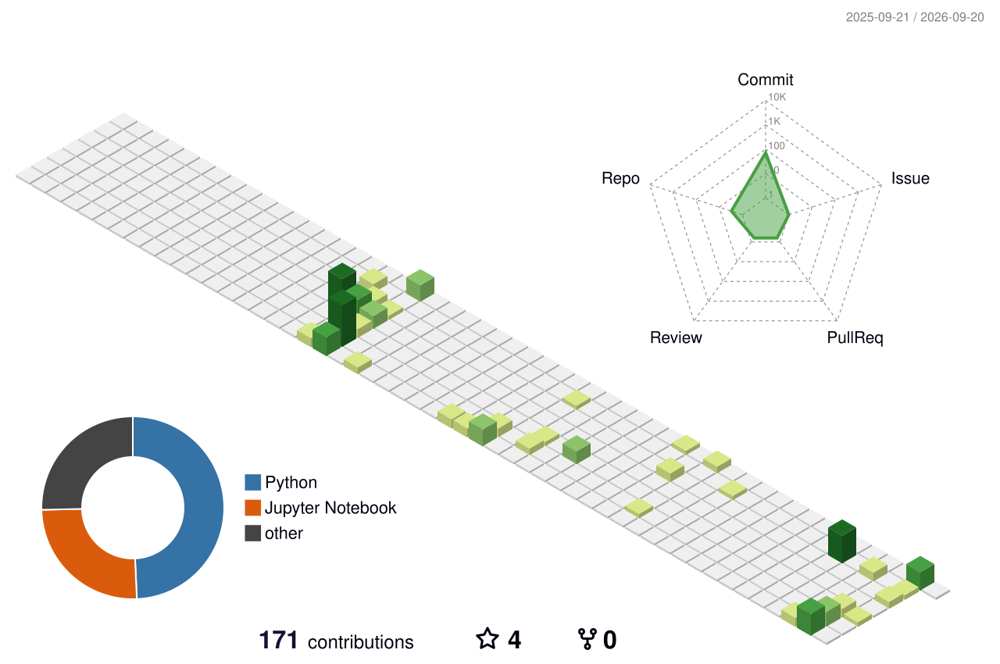

# 👋 Hi, I'm Vikash Sharma

### 🤖 B.Tech CSE (AI & ML) Student | Machine Learning Enthusiast | GenAI Explorer

  
  
  
  

---

## 🧑‍💻 About Me

I'm **Vikash Sharma**, a **B.Tech Computer Science & Engineering student specializing in Artificial Intelligence & Machine Learning**.

I enjoy learning how intelligent systems work and turning concepts into practical projects. My current focus is on **Machine Learning, Deep Learning, Generative AI, Data Science, and problem solving with Java and Python**.

* 🎓 B.Tech CSE (AI & ML) student at **Ghani Khan Choudhury Institute of Engineering and Technology (GKCIET), Malda**
* 🤖 Passionate about **Machine Learning, Deep Learning & Generative AI**
* 🌱 Currently learning **DSA in Python** and strengthening ML/AI fundamentals
* 🔭 Building practical AI/data projects and experimenting with agentic workflows
* 💼 Looking for opportunities to learn, collaborate and build impactful projects

---

## 🚀 Featured Projects

### 🔎 TraceFinder : Forensic Scanner Identification

A forensic image analysis project for identifying the source scanner/device from digital images.

**Highlights:** Hybrid CNN, Random Forest, SVM, PRNU analysis, FFT + Wavelet features, and Grad-CAM explainability.

### 🪪 Aadhaar Enrolment & Update Trends

A data-analysis project built for the **UIDAI Hackathon 2026**, exploring large-scale Aadhaar enrolment and update data to identify meaningful societal trends.

**Focus:** EDA, trend analysis, visualization, and insight generation.

### 📊 CSV Insight Agent

A GenAI-based agent that analyzes CSV datasets and answers data questions using actual calculations rather than guessing.

**Focus:** Python, Pandas, LLMs, tool calling, and data-analysis workflows.

---

## 🛠️ Tech Stack

  

### 🤖 AI / ML

  

  <b>Machine Learning • Deep Learning • Computer Vision • Generative AI • Data Science • NLP</b>

### 🧰 Libraries & Tools

  
  
  
  
  
  
  

---

## 💼 Experience & Learning

* **Infosys Springboard Virtual Internship 6.0**
  Building industry-oriented technical skills through project-based learning.

* **UIDAI Hackathon 2026**
  Worked on large-scale Aadhaar data analysis and societal trend discovery.

---

## 📈 GitHub Stats

  
  

  

---

## 🧊 GitHub Profile 3D Contributions

  

---

## 🏆 GitHub Trophies

  

---

## 🐍 Contribution Journey

  

---

## 🌐 Connect With Me

  
  
  
  
  

---

### ✨ *"Learn. Build. Break. Improve. Repeat."* ✨

⭐ **Thanks for visiting my profile!**

